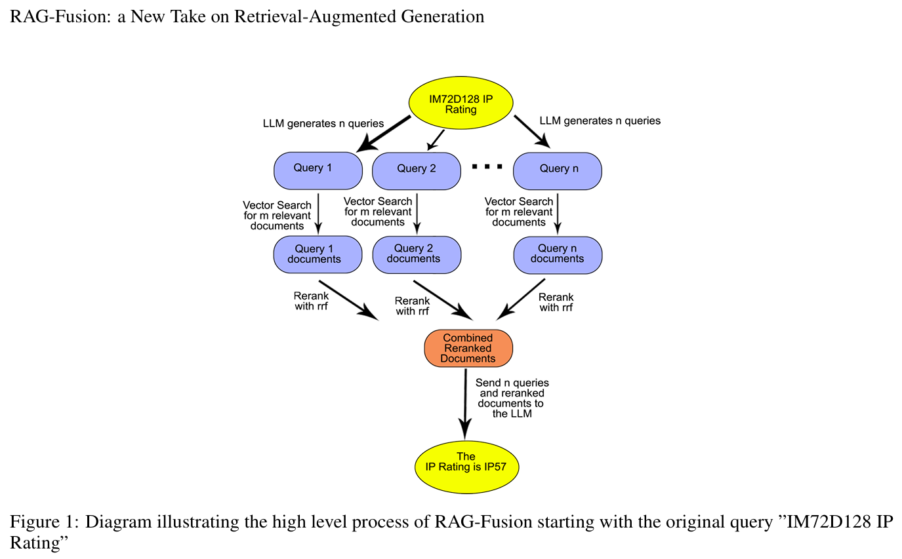
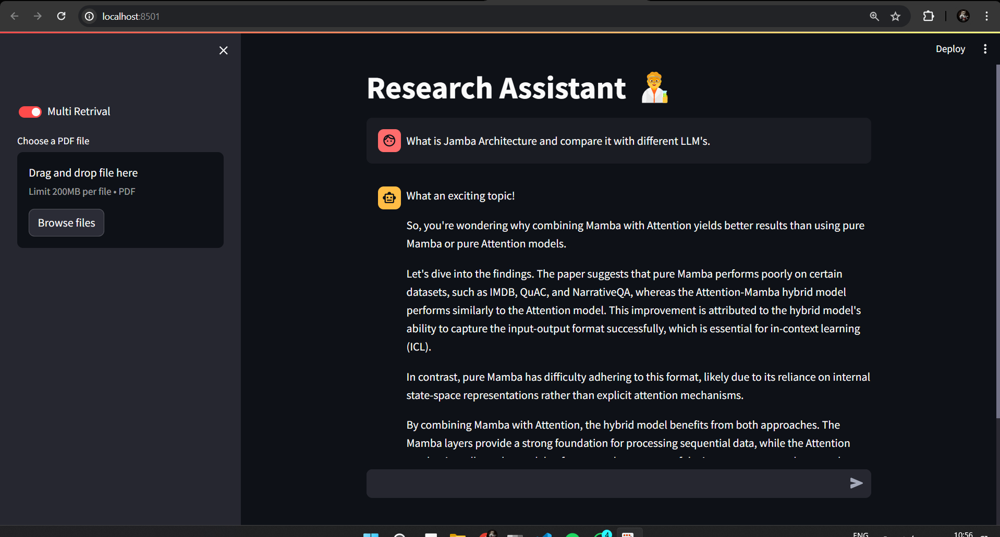
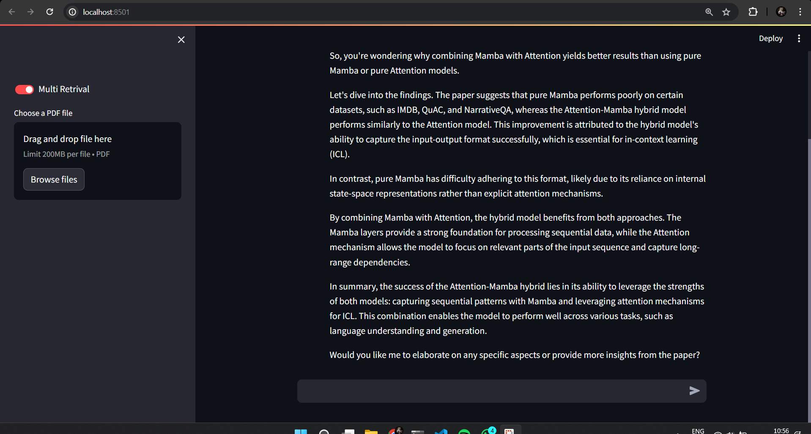
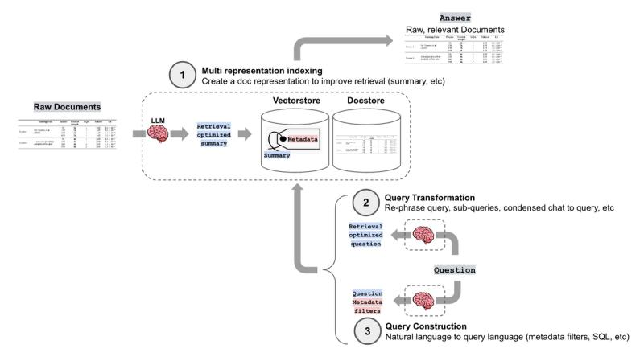

# Offline Retrieval-Augmented Generation Fusion (RAG-Fusion) Application with Ollama, Langchain, Llama3-8B, FAISS and Mistral-7B



Reference paper - https://arxiv.org/pdf/2402.03367

This project implements a complete offline RAG-Fusion application for text generation and retrieval, leveraging efficient local resources.

- **Offline Operation:** Runs entirely without internet connectivity, ideal for scenarios with limited or unreliable network access.
- **Zero Cost:** Utilizes freely available open-source tools, minimizing infrastructure expenses.
- **Ollama with Llama3-8B LLM:** Employs Ollama for offline execution of the powerful Llama3 large language model, enabling effective text generation.
- **FAISS Vector Database:** Leverages FAISS, a high-performance offline vector database, to efficiently store and retrieve document embeddings.
- **Hugging Face Embeddings:** Integrates pre-trained embeddings from Hugging Face for semantic representation of textual data.
- **MultiQueryRetriever:** automates the process of prompt tuning by using an LLM to generate multiple queries from different perspectives for a given user input query.


### Getting Started

Run the following commands on your terminal.

Clone this repository.
```
git clone https://github.com/RionDsilvaCS/research-assistant-rag-fusion.git
```

Install required dependencies (make sure you are inside the git dir)
```
pip install -r requirements.txt
```

To create your own vector db
```
cd DB
```

Configure project settings make sure you have the ollama running on your device.
https://ollama.com/download

https://ollama.com/library/llama3

https://ollama.com/library/mistral


Now everthying is ready to be run
```
cd APP
```

```
streamlit run app.py
```






### Offline RAG-Fusion Pipeline




### Boost Your Research Efficiency with These Powerful Benefits:

This RAG-Fusion powered research assistant offers a multitude of advantages to elevate your research game:

* **Enhanced Accuracy and Comprehensiveness:** RAG-Fusion ensures your queries retrieve the most relevant information from your research corpus, fostering a deeper understanding of your subject matter.
* **Spark New Research Avenues:** MultiQuery generation with Langchain helps you uncover hidden connections and explore diverse perspectives, leading to groundbreaking research possibilities.
* **Uninterrupted Workflow:**  Work seamlessly offline!  The vector store keeps your research data readily accessible, eliminating the need for an internet connection.
* **Cost-Effective Solution:** All the technologies used in this project are open-source, making this a powerful research tool without any licensing fees.
* **Improved Research Productivity:** Streamline your research process by effortlessly retrieving relevant information and gaining new insights, freeing up valuable time for analysis and exploration.
* **Offline Inspiration:**  This research assistant becomes your constant companion, ready to spark inspiration and guide your research journey even without an internet connection.

These benefits combined empower researchers to achieve greater efficiency, unlock new research avenues, and ultimately make significant contributions to their field.


----
### Follow me

>GitHub [@RionDsilvaCS](https://github.com/RionDsilvaCS)  ·  Linkedin [@Rion Dsilva](https://www.linkedin.com/in/rion-dsilva-043464229/)   ·  Twitter [@Rion_Dsilva_CS](https://twitter.com/rion_dsilva_cs)
